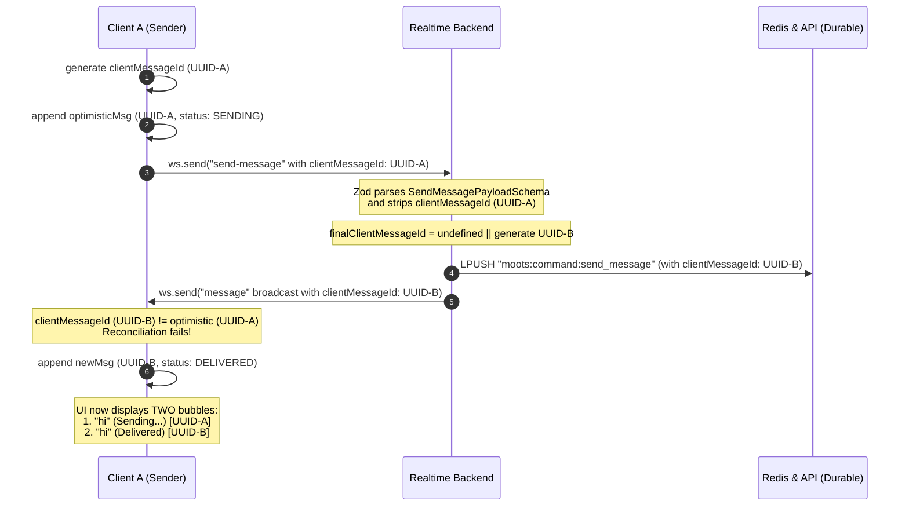

# Root Cause Analysis: Sender Receiving/Rendering Own Message Twice

An investigation into the message delivery pipeline has identified the exact source of duplicate message rendering for the message sender, along with a recommendation for robust, long-term synchronization.

---

## 1. Root Cause Summary

The duplicate message rendering is caused by a schema validation discrepancy in the shared `@moots/contracts` package. 

Specifically, **`SendMessagePayloadSchema`** does not declare the `clientMessageId` property. When a message is sent via WebSocket:
1. The frontend generates a unique `clientMessageId` (using `crypto.randomUUID()`) and appends it to the outgoing payload.
2. The Realtime backend parses the payload using Zod's `InboundMessageSchema.safeParse(...)` in [message.validator.ts](file:///e:/moots/backend/realtime/src/modules/delivery/message.validator.ts).
3. Since Zod strips undeclared keys by default, `clientMessageId` is **silently removed** from the validated payload.
4. The backend handler in [message.handler.ts](file:///e:/moots/backend/realtime/src/modules/delivery/message.handler.ts) receives `clientMessageId` as `undefined` and falls back to generating a **new, random UUID**.
5. This new UUID is broadcasted back to the client.
6. The sender's client receives the broadcasted message but fails to reconcile it with the optimistic message in state because the `clientMessageId` values do not match (original UI UUID vs. new backend UUID).
7. Consequently, the client appends the broadcasted message as a duplicate, leaving the original optimistic message permanently stuck in the `"Sending..."` state.

---

## 2. Complete Lifecycle Trace

Here is the step-by-step trace of a sent message under the current behavior:



---

## 3. Detailed Investigation Findings

### 3.1. Inbound Validation Schema
The validation schema `SendMessagePayloadSchema` defined in [ws.payloads.ts](file:///e:/moots/packages/contracts/src/realtime/ws.payloads.ts#L22-L30) restricts the incoming payload properties:
```typescript
export const SendMessagePayloadSchema = z.object({
  sessionId: z.string().min(1),
  content: z.string().min(1),
  replyTo: z.object({
    id: z.string(),
    senderId: z.string(),
    content: z.string(),
  }).optional(),
});
```
Because `clientMessageId` is absent from this definition, Zod strips it out during parsing, resulting in `undefined` by the time it reaches the handler.

### 3.2. Handler Fallback Generation
In [message.handler.ts](file:///e:/moots/backend/realtime/src/modules/delivery/message.handler.ts#L124):
```typescript
const finalClientMessageId = clientMessageId || (crypto.randomUUID ? crypto.randomUUID() : Math.random().toString(36).slice(2, 11));
```
Because the input `clientMessageId` was stripped and arrived as `undefined`, the handler generates a new ID. This ID is broadcasted to the room as both the message `id` and `clientMessageId`.

### 3.3. Sender Broadcast
The handler broadcasts the message to the entire room immediately:
```typescript
sessionService.broadcast(sessionId, {
  type: "message",
  payload: wsMsg,
}, registry);
```
Since the sender `actorId` is not excluded, the sender receives this broadcasted packet.

---

## 4. Architectural Recommendation

To ensure immediate delivery feedback, clean user interface states, and zero duplication, we recommend a dual-action correction:

### 1. Enable `clientMessageId` Propagation
* Add `clientMessageId: z.string().optional()` to `SendMessagePayloadSchema` in [ws.payloads.ts](file:///e:/moots/packages/contracts/src/realtime/ws.payloads.ts#L22-L30).
* This ensures that the generated ID propagates through the Zod parser to the handler, enabling perfect client-side reconciliation.

### 2. Exclude the Sender from Real-time Message Broadcasts
* Modify [message.handler.ts](file:///e:/moots/backend/realtime/src/modules/delivery/message.handler.ts) to pass `[actorId]` as the `excludeActorIds` parameter to `sessionService.broadcast(...)`.
* **Rationale**: The sender already has the message rendered optimistically on their screen. Sending the full message payload back over the WebSocket is redundant and wastes bandwidth. 
* **State Transition**:
  - The sender's optimistic message remains on screen in the `SENDING` state.
  - The sender does not receive the duplicate `type: "message"` event.
  - When the API asynchronously persists the message and publishes `message.persisted`, the Realtime server broadcasts `type: "message-persisted"`.
  - The sender receives `type: "message-persisted"`, matches it via `clientMessageId`, and transitions the message status from `"SENDING"` to `"PERSISTED"` ("Sent").

This architecture aligns with premium, low-latency WebSocket design principles and completely eliminates duplicate message rendering.

---

## 5. Patch Implementation Plan

Once approved, the proposed changes are straightforward:

### Phase 1: Shared Contracts Update
1. Update `SendMessagePayloadSchema` in [ws.payloads.ts](file:///e:/moots/packages/contracts/src/realtime/ws.payloads.ts#L22-L30) to include `clientMessageId: z.string().optional()`.
2. Build the `@moots/contracts` package using `pnpm run build` in the packages/contracts folder to propagate types to dependencies.

### Phase 2: Realtime Backend Update
1. Update [message.handler.ts](file:///e:/moots/backend/realtime/src/modules/delivery/message.handler.ts) `send-message` handler to pass the sender's `actorId` in `excludeActorIds` of `sessionService.broadcast`:
   ```typescript
   sessionService.broadcast(sessionId, {
     type: "message",
     payload: wsMsg,
   }, registry, [actorId]);
   ```
